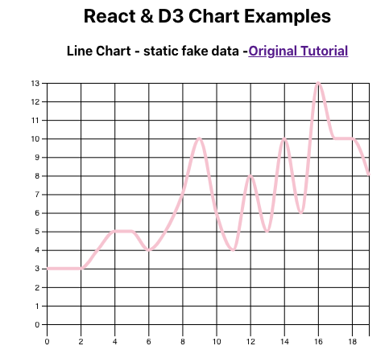
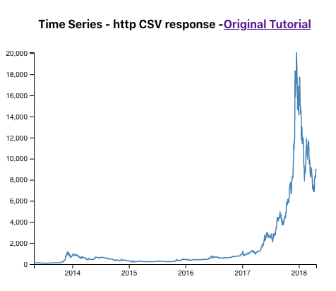
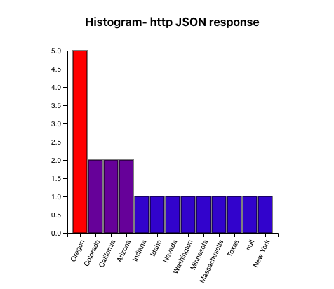

# React & D3 Chart Examples
Examples of how to use D3 charts in React.
Follow along with the youtube video (link below) to build the charts in this repo.

## Finished Product

## YouTube Tutorial Link
[YouTube tutorial](https://www.youtube.com/) for this app.

## Create this app from scratch

1. Command Line

install create-react-app  
`npm install create-react-app`

use create-react-app to initialize new app  
`npx create-react-app my_new_app`

navigate into newly created app  
`cd my_new_app`

install d3  
`npm install d3`

2. Replace the contents of the app.js file with this repo's app.js
3. build chart components or drop chart components into src folder

